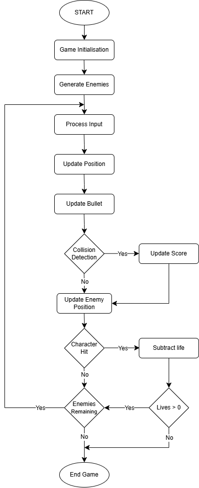
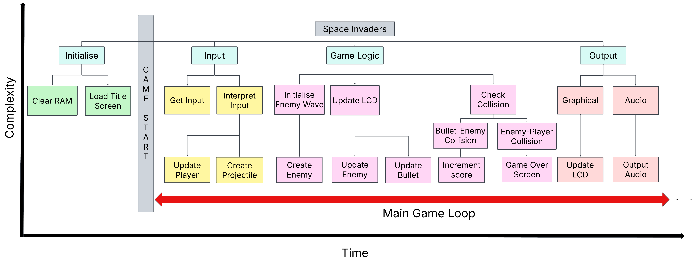

# 🕹️ Space Invaders on a PIC18 Microprocessor

This project implements the classic arcade game **Space Invaders** on a **PIC18F87K22 microcontroller**, programmed entirely in **assembly (MPASM)** and run on the **EasyPIC Pro V7** board. It demonstrates how interactive embedded systems can be designed under strict hardware constraints using low-level programming.

---

## 📁 Project Documentation

| File | Description |
|------|-------------|
| [`Reports/Microprocessors Project Proposal - Space Invaders.pdf`](Reports/Microprocessors%20Project%20Proposal%20-%20Space%20Invaders.pdf) | Initial proposal covering objectives, hardware choices, and early design |
| [`Reports/Laksh_Microprocessors_Report.pdf`](Reports/Laksh_Microprocessors_Report.pdf) | Full technical report including architecture, software logic, testing, and results |
| [`Reports/space_flow.drawio.png`](Reports/space_flow.drawio.png) | Flowchart of the main game loop showing logic execution |
| [`Reports/top-down.png`](Reports/top-down.png) | Top-down modular software structure for game components |

---

## 🛠️ Hardware Components

- **PIC18F87K22 Microcontroller** – Central game logic and control
- **128×64 Graphical LCD** – Renders all visual elements including cannon, aliens, bullets, score
- **4×4 Keypad** – Allows player movement, firing, and game control
- **EasyPIC Pro V7** – Integration platform for I/O and peripherals
- **Buzzer** – Audio feedback for shooting, hits, and game over
- **Power Supply** – 15V stable power input

---

## 💻 Software Design

- **Language:** Assembly (MPASM)
- **IDE:** MPLAB X IDE
- **Design:** Modular — separate files and routines for input handling, game logic, movement, rendering, and sound
- **Input:** Handled via interrupt-driven keypad scanning on PORT E
- **Output:** 128x64 GLCD connected via PORT B & D, buzzer controlled via PORT B pin 6

---

## 🔁 Main Game Loop

The game loop handles:
- Scanning keypad input (left, right, shoot, start/reset)
- Updating player/enemy/bullet positions
- Detecting collisions
- Managing game state and score
- Drawing to GLCD and triggering sound
- Introducing a 90ms delay to stabilize framerate (≈ 9.5 FPS)

---

## 🧱 Software Architecture

The software is organized into clear layers:
- **Initialization** of hardware components
- **User Input Module** with interrupt polling
- **Game Engine** for logic control and physics
- **Graphics Engine** for LCD pixel rendering
- **Audio Module** for PWM-based sound effects

---

## 📊 Performance & Results

| Metric | Value |
|--------|-------|
| Frame Rate | 9.5 ± 0.04 FPS |
| Program Memory Used | 2.5% |
| Data Memory Used | 2.3% |
| Collision Detection | 100% Accuracy |
| Frame Duration Deviation | ± 0.48 ms |

Key takeaways:
- Smooth visual performance with minimal GLCD flickering
- Consistent frame updates with 90ms delays
- Interrupt-based keypad ensures fast and accurate user input
- Bullet–enemy and enemy–player collisions handled with edge-case detection

---

## 🧩 Features

- Real-time gameplay on 128x64 LCD
- Bullet cooldown and shooting logic
- Score tracking and bitmap display
- Game-over and title screen bitmaps
- Randomized enemy spawning using Linear Congruential Generator (LCG)
- Audio tones generated via toggling signal on buzzer pin

---

## 🚧 Limitations & Improvements

**Current limitations:**
- No persistent high score memory (lost on power cycle)
- No life system – game ends on first hit
- No level progression or difficulty scaling
- GLCD updates can bottleneck when multiple objects move

**Suggested enhancements:**
- Store high score in EEPROM (1kB available)
- Add lives system using bitmap icons
- Introduce level system with enemy patterns/speeds
- Optimise GLCD writes to only redraw changed pixels

---
**Key takeaways from the project**
- Understanding how to use PIC18 Microprocessor and other electrical components
- Writing assembly instructions to the processor to update I/O peripherals
- Structuring modular code for further additons and debugging. 
